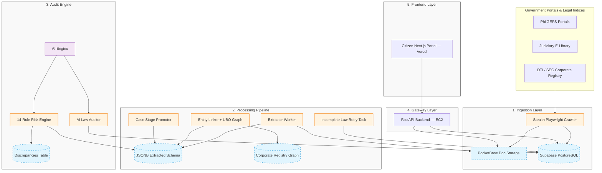

# ⚖️ Veritas — Philippines Procurement Transparency Platform

<div align="center">

[](https://opensource.org/licenses/AGPL-3.0)
[](https://python.org)
[](https://nodejs.org)
[](https://fastapi.tiangolo.com)
[](https://nextjs.org)
[](https://supabase.com)

**"Evidence before narrative. Every flag is explainable. Every claim is traceable."**

*Veritas is a community-driven, open-source civic technology platform for public procurement auditing and legislative transparency in the Philippines.*

[Key Features](#-key-features) • [Architecture](#-system-architecture) • [Quick Start](#-quick-start) • [Audit Rules](#-procurement-anomaly-engine-14-audit-rules) • [Math Models](#-project-risk-scoring--math-models) • [AI Engine](#-ai-audit-engine) • [License](#-license)

</div>

---

Veritas acts as an **evidence-first intelligence pipeline**. It automatically ingests, normalizes, and cross-links public government documents (PhilGEPS opportunities, COA Annual Audit Reports, DBM circulars, and GPPB laws). By combining rule-based statutory checks, statistical risk modeling, and LLM-driven legislative vulnerability analysis, Veritas surfaces risks for civil society watchdogs, investigative journalists, and public administrators.

> [!NOTE]
> **Veritas does not accuse.** It detects statistical anomalies, highlights statutory deviations, and provides absolute traceability back to official documents, leaving final determinations to human reviewers.

---

## 🚀 Key Features

* **14-Rule Procurement Anomaly Engine:** Scans every contract award using fourteen specialized mathematical checks aligned with **RA 9184** and **RA 12009**. Flags single-bidder collusion, budget splitting, variation order abuse, compressed timelines, and geographic license mismatches.
* **Project Lifecycle Stage Promotion:** Automatically transitions procurement projects through operational stages (`active_bidding` → `under_evaluation` → `awarded` → `ongoing` → `completed` → `cancelled`) based on real-time date comparisons and Notice to Proceed (NTP) issuance.
* **AI Audit Reports:** Every procurement project receives a real-time AI-generated predictive risk assessment (active projects) or post-mortem forensic audit (completed projects) citing specific risk factors and probability of cost overrun.
* **Ultimate Beneficial Ownership (UBO) Network Mapping:** Detects collusive bidding through corporate registry analysis — when multiple companies competing for the same contract share common directors, shareholders, or registered office addresses.
* **Upstream Legislative Auditing:** Evaluates legal texts (Republic Acts, IRR, GPPB Resolutions, COA Circulars) for vulnerabilities, outputting an **Integrity Index** and **Oversight Score** based on ambiguous scopes or mandated civil society observers.
* **Five-Dimensional Risk Vector:** Every project produces a radar chart across Competition, Timeline, Financial, Transparency, and Compliance dimensions for granular vulnerability mapping.
* **Financial Delta Tracking:** Visualizes the full budget lifecycle — from Approved Budget (ABC) to awarded amount to final paid amount — flagging variation order padding.
* **Traceable Visual Provenance:** Anchors extracted data points directly to coordinates `[page_number, char_start, char_end]` on SHA256-hashed source documents.
* **Contractor Transparency:** Every project detail page prominently shows the awarded contractor (supplier) with a link to their full risk profile — mandatory for public accountability.
* **Citizen Dossier Export:** Each project can be exported as a full JSON or CSV data bundle for investigative journalists and watchdog organizations.
* **Stealth Crawling:** Bypasses anti-bot controls on government registries using automated browser contexts with custom User-Agents, realistic viewports, and hidden WebDriver parameters.

---

## 🗺️ System Architecture



### 📁 Repository Layout
```yaml
veritas-ph/
├── apps/
│   ├── web-public/         # Next.js citizen portal (Vercel)
│   └── api/                # FastAPI backend + background workers (EC2 / Port 8000)
│       ├── main.py         # REST API endpoints (1400+ lines)
│       ├── queries.py      # PostgreSQL query layer
│       ├── queries_legislation.py
│       ├── database.py     # Async SQLAlchemy engine
│       ├── auth.py         # JWT authentication
│       ├── schemas.py      # Pydantic response models
│       ├── storage.py      # PocketBase document store client
│       ├── init_db.py      # Schema DDL + migration runner
│       ├── seed_cases.py   # Procurement project seed data
│       ├── seed_legislation.py # Legislation seed data
│       ├── reset_db.py     # Full DB wipe and reseed script
│       └── workers/
│           ├── analyzer_worker.py  # Main background orchestrator
│           └── tasks/
│               ├── risk_engine.py  # 14-rule audit + AI reports
│               ├── law_analyzer.py # Legislative vulnerability AI auditor
│               ├── case_updater.py # Automatic lifecycle stage promoter
│               └── law_updater.py  # Retries incomplete law text parsing
├── packages/
│   ├── config/             # Shared ESLint, TS, and Prettier configurations
│   ├── types/              # Unified TypeScript definitions
│   └── ui/                 # Shared UI components
├── pb_bin/                 # PocketBase binary directory
├── pb_data/                # PocketBase local files & document storage
├── docs/                   # Architectural blueprints and legal standards
└── Makefile                # Master automation script
```

---

## 🌐 Platform Deployments & Ecosystem

Veritas is deployed as a fully integrated, live civic technology network:

* 👥 **Citizen Portal:** [https://veritas-ph-web-public.vercel.app](https://veritas-ph-web-public.vercel.app)
  * Public dashboard for investigative journalists, civil society watchdogs, and citizens to explore procurement projects, track agency risk scores, and search audited legislative indexes.
* ⚙️ **API Backend:** [https://47.129.63.52](http://47.129.63.52) (AWS EC2, Singapore)
  * FastAPI engine powering all public REST APIs. Hosts the Swagger UI documentation at `/docs`.

---

## 🔍 Procurement Anomaly Engine (14 Audit Rules)

Veritas runs fourteen compliance and statistical audits on every contract award and tender notice.

| Rule ID | Anomaly / Check | Severity | Risk Dimension | Statutory Reference |
| :--- | :--- | :--- | :--- | :--- |
| **RULE-001** | Single Bidder on High-Value Contract | High | Competition | RA 9184 Sec. 36 |
| **RULE-002** | Potential Budget Splitting / Alternative Overuse | High | Financial | RA 9184 Sec. 54.1 & COA Guidelines |
| **RULE-003** | Short Posting Window | Medium | Procedural | RA 9184 Sec. 21.2.1 |
| **RULE-004** | Award-to-Budget Overshoot | High | Financial | RA 9184 Sec. 31 |
| **RULE-005** | Variation Order Abuse (>10% contract value) | High | Financial | RA 9184 Annex E Sec. 1.3 |
| **RULE-006** | APP-Tender Mismatch | Medium | Transparency | RA 9184 Sec. 7.2 |
| **RULE-007** | Unrelated Supplier Win | High | Competition | RA 9184 Sec. 23 |
| **RULE-008** | Late Notice to Proceed (NTP) | Medium | Timeline | RA 9184 Sec. 37.4.1 |
| **RULE-009** | Missing Bid Abstract | High | Transparency | RA 9184 Sec. 37 |
| **RULE-010** | Active COA Audit Findings | Medium | Compliance | 1987 Constitution Art. IX-D |
| **RULE-011** | Award Before Bid Deadline | Critical | Timeline | RA 9184 Sec. 37 |
| **RULE-012** | HHI Market Concentration Anomaly | High | Competition | RA 10667 Philippine Competition Act |
| **RULE-013** | Price Benchmark Anomaly | High | Financial | COA Value-for-Money Audit Guidelines |
| **RULE-014** | Geographic PCAB License Mismatch | Medium | Compliance | PCAB Accreditation Rules |

---

## ⚖  Project Risk Scoring & Math Models

### 1. Weighted Severity Scoring
Veritas aggregates anomalies into a combined risk index ($R$) bounded between $0.0$ and $1.0$:

$$R = \min\left(1.0, \sum W_i\right)$$

Where discrepancy severity weights ($W_i$) are defined as:
* 🛑 **Critical** ($W_i = 1.0$): Hard-constrains project risk to $\ge 0.80$ (e.g., *Award Before Bid Deadline*).
* 🟠 **High** ($W_i = 0.6$): Severe competition/financial checks (e.g., *Budget Splitting*).
* 🟡 **Medium** ($W_i = 0.3$): Timeline or compliance deviations (e.g., *Short Posting Window*).
* 🔵 **Low** ($W_i = 0.1$): Minor record inconsistencies.

### 2. Five-Dimensional Risk Vector ($V_{\text{risk}}$)
Every project maps to a risk vector indicating specific compliance vulnerabilities:

$$V_{\text{risk}} = [C_{\text{comp}}, C_{\text{time}}, C_{\text{fin}}, C_{\text{trans}}, C_{\text{compl}}]$$

Where:
* $C_{\text{comp}}$: Competition Risk (RULE-001, 007, 012)
* $C_{\text{time}}$: Timeline Anomalies (RULE-003, 008, 011)
* $C_{\text{fin}}$: Budget/Overrun Leakage (RULE-002, 004, 005, 013)
* $C_{\text{trans}}$: Transparency / Missing Information (RULE-006, 009)
* $C_{\text{compl}}$: Regulatory Compliance Deviations (RULE-010, 014)

---

## 🤖 AI Audit Engine

Every procurement project and piece of legislation is audited section-by-section.

### Predictive Risk Assessment (Active Projects)
For ongoing contracts, the AI generates:
- **Probability of Cost Overrun** (float 0–1) based on contractor historical performance, bid-to-ABC ratio, and project type
- **Rationale** (3–4 sentences) citing specific risk factors

### Post-Mortem Forensic Audit (Completed Projects)
For completed contracts, the AI generates:
- Evidence-based analysis of budget padding and variation order patterns
- Identification of statutory loopholes exploited
- Contractor accountability summary

### Legislative Vulnerability Analysis
For each law in the system, the AI produces:
- **Integrity Index ($I_L$)**: Loophole tightness score (0–100)
- **Oversight Score ($O_L$)**: Governance and monitoring quality (0–100)
- **Loopholes / Pros / Cons / Suggested Revisions**: Structured JSON
- **Citizen Summary**: Plain-language explanation for public consumption

---

## 📜 Legislative Vulnerability Auditing

### Integrity Index ($I_L$)
$$I_L = 100 - \sum \text{Vulnerability\_Weight}_i$$

* **Critical Loophole** ($-20$): Direct conflict of interest loopholes.
* **High Vulnerability** ($-15$): Bypassing competitive standards under emergency declarations.
* **Medium Vulnerability** ($-8$): Broad subjective audit definitions.
* **Low Vulnerability** ($-3$): Weak reporting guidelines.

### Oversight Score ($O_L$)
$$O_L = \sum \text{Oversight\_Factor}_j$$

* **CS Observers Explicitly Mandated** ($+25$)
* **Open Data Reporting Required** ($+25$)
* **Clear Penal / Punitive Clauses** ($+25$)
* **Independent Auditing Mandated** ($+25$)

---

## 🕸️ UBO Network Mapping (Corporate Registry Analysis)

Veritas cross-references contractor corporate registry data to detect hidden relationships between competing bidders:

```
Collusion Flag = True  if  any two bidders on the same project share:
  - A common major shareholder (≥ 10% ownership)
  - The same registered business address
  - A common director or officer
```

This catches cartel arrangements where multiple nominally independent companies submit bids for the same project while being controlled by the same beneficial owner.

---

## 🕷️ Stealth Government Crawling

Due to aggressive IP blocking and anti-automation filters on official Philippine portals, Veritas crawler uses active bypass techniques:

1. **User-Agent Masquerading:** Injects high-reputation Chromium desktop string.
2. **Automation Flag Suppression:** Overrides page context structures dynamically on load:
   ```javascript
   Object.defineProperty(navigator, 'webdriver', {get: () => undefined})
   ```
3. **Emulated Viewport & Resolution:** Forces realistic Full-HD screen viewports (`1920x1080`) to simulate genuine browser profiles.

---

## 🛠️ Quick Start

Veritas runs in a **Zero-Docker local development configuration**, optimizing startup latency.

### Prerequisites
* Python 3.12+
* Node.js 20+
* PostgreSQL 15+ (or use Supabase)

### 📦 Installation
1. Clone the repository:
   ```bash
   git clone https://github.com/santimacorp-droid/veritas-ph.git
   cd veritas-ph
   ```
2. Install Python virtual environments and node modules:
   ```bash
   make install
   ```
3. Copy and configure environment variables:
   ```bash
   cp .env.example .env
   # Edit .env with your DATABASE_URL, etc.
   ```

### 🗄️ Database Setup
Initialize the database schema:
```bash
make init-db
```

For a full clean wipe (drops all tables):
```bash
cd apps/api && python reset_db.py
```

### 💻 Running Development Servers
```bash
make dev
```
* **Citizen Portal:** `http://localhost:3000`
* **FastAPI Backend:** `http://localhost:8000`
* **API Docs (Swagger):** `http://localhost:8000/docs`
* **PocketBase Document Admin:** `http://localhost:8090/_/`

### 🤖 Starting the AI Analyzer
The background worker runs risk scoring and AI analysis continuously:
```bash
# On EC2 / production:
sudo systemctl start veritas-analyzer

# Locally:
cd apps/api && python workers/analyzer_worker.py
```

---

## 🧪 Testing & Linting
```bash
make test      # Run backend pytest suite
make lint      # TypeScript + Python style checks
make format    # Apply Python auto-formatting
```

---

## 📜 License

Veritas is licensed under the **GNU Affero General Public License v3 (AGPL-3.0)**.

### Why AGPL-3.0?
Veritas is civic-tech software meant for public good, accountability, and transparency. The AGPL-3.0 license protects this mission by ensuring that **any modifications or enhancements made to Veritas — even if run purely as a cloud/web service — must be released as open-source code under the same license**. This prevents proprietary closed forks and ensures the community's work remains public forever.

For details, see the [LICENSE](LICENSE) file.
