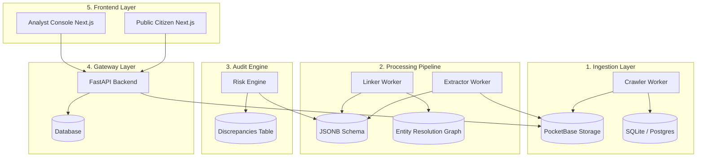

# ⚖️ Veritas — Philippines Procurement Transparency Platform

[](https://opensource.org/licenses/MIT)
[](https://python.org)
[](https://nodejs.org)
[](https://fastapi.tiangolo.com)
[](https://nextjs.org)

> **"Evidence before narrative. Every flag is explainable. Every claim is traceable."**

Veritas is an open-source, evidence-first procurement intelligence platform that collects, normalizes, and cross-links public government documents (PhilGEPS, COA, DBM, GPPB) in the Philippines. It implements statutory auditing formulas, statistical risk models, and legislative AI scoring to surface procurement anomalies, assisting journalists, civil society watchdogs, and citizens in monitoring government contracts.

**Veritas does not accuse. It surfaces anomalies and lets humans decide.**

---

## 🗺️ System Architecture

Veritas follows a phased data lifecycle: **Ingest → Extract → Link → Risk Engine → Audit → Disclosure**.



### 📁 Repository Layout
```yaml
veritas-ph/
├── apps/
│   ├── web-public/         # Next.js citizen portal (Port 3005)
│   ├── web-analyst/        # Next.js analyst console (Port 3001)
│   └── api/                # FastAPI backend + Alembic migrations (Port 8000)
├── packages/
│   ├── config/             # Shared ESLint, TS configs
│   ├── types/              # Shared TypeScript definitions
│   └── ui/                 # Reusable UI component library (Citations, Badges)
├── pb_bin/                 # PocketBase local server binary (Document Store)
├── pb_data/                # PocketBase local files & document storage
├── docs/                   # System design, legal standards, and architectural blueprints
├── Makefile                # Master automation script
├── pyproject.toml          # Python package config (Ruff/Pytest settings)
└── package.json            # npm workspaces root
```

---

## ⚡ Zero-Docker Quick Start

Veritas features a **Zero-Docker development environment** designed for light, fast local runs using SQLite and PocketBase.

### 1. Prerequisites
Ensure you have the following installed on your host system:
* **Python 3.11+**
* **Node.js 20+** and `npm`

### 2. Setup & Installation
Run the master installer from the root directory to set up both Node workspaces and the Python virtual environment (`.venv_linux`):
```bash
make install
```

### 3. Initialize PocketBase (Document Store)
Download and configure PocketBase as a local filesystem document store:
```bash
make pb-install
```

### 4. Database Setup & Seeding
Initialize the SQLite database and seed the government agency registry, controversial laws, and mock case records:
```bash
make init-db
```

### 5. Launch All Services (Development)
Run all backend, worker, and frontend services concurrently in one terminal window:
```bash
make dev
```
Once launched, the services will run at:
* 🌐 **Public Citizen Portal:** [http://localhost:3005](http://localhost:3005)
* 💼 **Analyst Admin Console:** [http://localhost:3001](http://localhost:3001)
* ⚙️ **FastAPI REST API:** [http://localhost:8000](http://localhost:8000)
* 📘 **API Documentation:** [http://localhost:8000/api/docs](http://localhost:8000/api/docs)
* 📦 **PocketBase Admin:** [http://localhost:8090/_/](http://localhost:8090/_/)

---

## 🔍 Procurement Anomaly Engine (14 Audit Rules)

Veritas runs fourteen specialized mathematical audits on every contract award and tender notice to detect anomalies corresponding to the Philippine Government Procurement Reform Act (**RA 9184**) and the New Government Procurement Act (**RA 12009**).

| Rule ID | Name | Severity | Risk Type | Formula / Logic | Statutory Reference |
| :--- | :--- | :--- | :--- | :--- | :--- |
| **RULE-001** | Single Bidder on High-Value Contract | High | Competition | `Bidders == 1` AND `Contract Value >= 10M PHP` | RA 9184 Sec. 36 |
| **RULE-002** | Potential Budget Splitting | High | Financial | Multiple SVP/Shopping awards by same Agency & Category within $\pm30$ days exceeding $1\text{M PHP}$ total | RA 9184 Sec. 54.1 & COA Guidelines |
| **RULE-003** | Short Posting Window | Medium | Procedural | `Notice Window < Minimum Posting Days` (e.g., <20 days public bidding) | RA 9184 Sec. 21.2.1 |
| **RULE-004** | Award-to-Budget Overshoot | High | Financial | `Award Value > Planned ABC * 1.20` | RA 9184 Sec. 31 (ABC ceiling) |
| **RULE-005** | Variation Order Abuse | High | Financial | Cumulative amendments/variations $> 10\%$ of original contract | RA 9184 Annex E Sec. 1.3 |
| **RULE-006** | APP-Tender Mismatch | Medium | Transparency | `Count(linked_app_items) == 0` | RA 9184 Sec. 7.2 |
| **RULE-007** | Unrelated Supplier Win | High | Competition | Supplier wins contract completely outside of registered specialized sectors | RA 9184 Sec. 23 |
| **RULE-008** | Late Notice to Proceed (NTP) | Medium | Timeline | `NTP Date - Award Date > 15 days` OR `NTP Date < Award Date` | RA 9184 Sec. 37.4.1 |
| **RULE-009** | Missing Bid Abstract | High | Transparency | `Has Award == True` AND `Count(Abstract Docs) == 0` | RA 9184 Sec. 37 |
| **RULE-010** | Active COA Audit Findings | Medium | Compliance | Agency has unresolved COA findings for the award's fiscal year | 1987 Constitution Art. IX-D |
| **RULE-011** | Award Before Bid Deadline | Critical | Timeline | `Award Date < Bid Closing Deadline` | RA 9184 Sec. 37 |
| **RULE-012** | HHI Market Concentration Anomaly | High | Competition | Sector Herfindahl-Hirschman Index $HHI > 2500$ (indicating potential cartels) | RA 10667 (Competition Act) |
| **RULE-013** | Price Benchmark Anomaly | High | Financial | `Unit Price > Historical Mean + 2 * StdDev` | COA Value-for-Money Audits |
| **RULE-014** | Geographic Mismatch | Medium | Compliance | Project location is outside the contractor's registered license regions | PCAB Accreditation Rules |

---

## ⚖️ Case Risk Scoring & Math Models

### 1. Weighted Severity Scoring
Instead of simply counting anomalies, Veritas weights flags by severity using a standard **weighted severity scoring model** ($R$):

$$R = \min\left(1.0, \sum W_i\right)$$

Where the discrepancy weights ($W_i$) are defined as:
* 🛑 **Critical** ($W = 1.0$): Severe statutory violations (e.g., *Award Before Bid Deadline*). If any Critical rule triggers, the final risk score is **hard-constrained to $\ge 0.80$**.
* 🟠 **High** ($W = 0.6$): Major competition/budget flags (e.g., *Budget Splitting*).
* 🟡 **Medium** ($W = 0.3$): Procedural/timeline deviations (e.g., *Short Posting Window*).
* 🔵 **Low** ($W = 0.1$): Minor timeline delays.

### 2. Five-Dimensional Risk Vector ($V_{\text{risk}}$)
Every dossier records a risk profile component vector mapping specific compliance paths:

$$V_{\text{risk}} = [C_{\text{comp}}, C_{\text{time}}, C_{\text{fin}}, C_{\text{trans}}, C_{\text{compl}}]$$

* **Competition ($C_{\text{comp}}$)** = $\max(\text{RULE-001}, \text{RULE-007}, \text{RULE-012})$
* **Timeline ($C_{\text{time}}$)** = $\max(\text{RULE-003}, \text{RULE-008}, \text{RULE-011})$
* **Financial ($C_{\text{fin}}$)** = $\max(\text{RULE-002}, \text{RULE-004}, \text{RULE-005}, \text{RULE-013})$
* **Transparency ($C_{\text{trans}}$)** = $\max(\text{RULE-006}, \text{RULE-009})$
* **Compliance ($C_{\text{compl}}$)** = $\max(\text{RULE-010}, \text{RULE-014})$

---

## 📜 Legislative Vulnerability Auditing (AI Engine)

To audit vulnerabilities upstream in legal texts, Veritas utilizes Large Language Models (DeepSeek V3 / GPT-4o-mini) to scan, classify, and score statutory loopholes.

### Integrity Index ($I_L$)
Evaluates the statutory tightness of the law. Discretionary exemption clauses or ambiguous scopes reduce the index:

$$I_L = 100 - \sum \text{Vulnerability\_Weight}_i$$

* **Critical Loophole** ($-20$)
* **High Vulnerability** ($-15$)
* **Medium Vulnerability** ($-8$)
* **Low Vulnerability** ($-3$)

### Oversight Score ($O_L$)
Evaluates monitoring mechanisms, transparency obligations, CS observer presence, and penalties:

$$O_L = \sum \text{Oversight\_Factor}_j$$

* **CS Observers Explicitly Mandated** ($+25$)
* **Open Data Reporting Required** ($+25$)
* **Clear Penal / Punitive Clauses** ($+25$)
* **Independent Auditing Mandated** ($+25$)

---

## 🛠️ Makefile Reference

| Target | Description |
| :--- | :--- |
| `make install` | Installs npm workspaces and Python pip packages inside `.venv_linux` |
| `make pb-install` | Downloads and installs the PocketBase binary under `./pb_bin` |
| `make pb-start` | Starts PocketBase service locally on port 8090 |
| `make init-db` | Configures and seeds local SQLite database schemas |
| `make api` | Launches backend FastAPI web server with reload flag |
| `make worker` | Runs the Python ingestion, extraction, and linking worker processes |
| `make dev` | Concurrently launches API, background worker, and both Next.js applications |
| `make test` | Executes the entire pytest suite |
| `make lint` | Validates styles using Ruff (Python) and ESLint (JS/TS) |
| `make format` | Reformats Python source code using Ruff |

---

## 🛡️ Guiding Principles

1. **Evidence Before Narrative**: We never auto-accuse. Veritas highlights discrepancy patterns and lets human journalists and investigators trace them.
2. **Immutable Provenance**: Every extraction is linked to coordinates `[page, char_start, char_end]` on a hashed, immutable source document.
3. **Public Data Only**: We strictly ingest public files. No unverified leaks or non-public personal information.
4. **Explainable Audits**: Every flag fires with explainable metadata (`why_fired`, thresholds, rules applied).
5. **Human in the Loop**: Analysts review, annotate, and verify all cases prior to publishing dossiers to the citizen portal.

---

## 📄 License
This repository is licensed under the **MIT License**. See [LICENSE](file:///media/santima/Storage/Projects/veritas-ph/LICENSE) for details.
