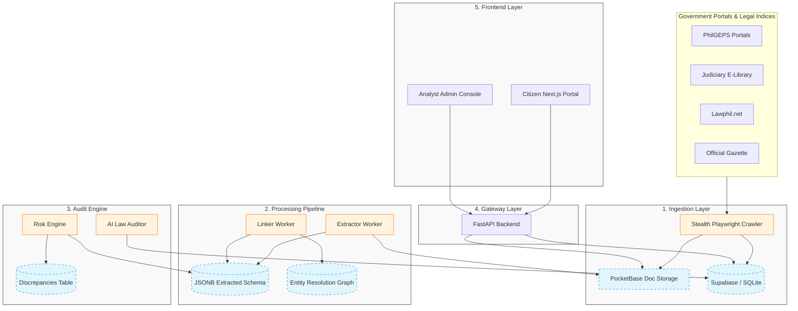

# ⚖️ Veritas — Philippines Procurement Transparency Platform

<div align="center">

[](https://opensource.org/licenses/AGPL-3.0)
[](https://python.org)
[](https://nodejs.org)
[](https://fastapi.tiangolo.com)
[](https://nextjs.org)
[](https://supabase.com)

**"Evidence before narrative. Every flag is explainable. Every claim is traceable."**

*Veritas is a community-driven, open-source civic technology platform for public procurement auditing and legislative transparency in the Philippines.*

[Key Features](#-key-features) • [Architecture](#-system-architecture) • [Quick Start](#-quick-start) • [Audit Rules](#-procurement-anomaly-engine-14-audit-rules) • [Math Models](#-case-risk-scoring--math-models) • [Stealth Scraping](#-stealth-government-crawling) • [License](#-license)

</div>

---

Veritas acts as an **evidence-first intelligence pipeline**. It automatically ingests, normalizes, and cross-links public government documents (PhilGEPS opportunities, COA Annual Audit Reports, DBM circulars, and GPPB laws). By combining rule-based statutory checks, statistical risk modeling, and LLM-driven legislative vulnerability analysis, Veritas surfaces risks for civil society watchdogs, investigative journalists, and public administrators.

> [!NOTE]
> **Veritas does not accuse.** It detects statistical anomalies, highlights statutory deviations, and provides absolute traceability back to official documents, leaving final determinations to human reviewers.

---

## 🚀 Key Features

* **Upstream Legislative Auditing:** Evaluates legal texts (Republic Acts, IRR, GPPB Resolutions, COA Circulars) for vulnerabilities, outputting an **Integrity Index** and **Oversight Score** based on ambiguous scopes or mandated civil society observers.
* **Double-Tier Pipeline Visualizer:** Transparently separates completed legislative loophole audits from newly indexed legislation awaiting AI review in an active backlog featuring live auditing status updates.
* **Downstream Procurement Auditing:** Scans active bids and tenders using **14 specialized mathematical checks** aligned with the Government Procurement Reform Act (**RA 9184**) and the New Government Procurement Act (**RA 12009**).
* **Stealth Scraping Evasion:** Bypasses anti-bot controls on government registries by utilizing automated browser contexts with customized User-Agents, realistic viewports, and hidden WebDriver parameters.
* **Financial Delta Tracking:** Visualizes the budget lifecycle by tracking the discrepancy between the Approved Budget for the Contract (ABC), the awarded contract amount, and the final paid amount.
* **Traceable Visual Provenance:** Anchors extracted data points directly to specific coordinates `[page_number, char_start, char_end]` on SHA256-hashed source documents.
* **Citizen Portal & Analyst Console:** Next.js portals offering public discovery of procurement risks alongside a secure workspace for civil society annotations and audits.

---

## 🗺️ System Architecture



### 📁 Repository Layout
```yaml
veritas-ph/
├── apps/
│   ├── web-public/         # Next.js citizen portal (Port 3000)
│   ├── web-analyst/        # Next.js analyst workspace (Port 3001)
│   └── api/                # FastAPI backend + Celery workers (Port 8000)
├── packages/
│   ├── config/             # Shared ESLint, TS, and Prettier configurations
│   ├── types/              # Unified TypeScript definitions (Discrepancy, Law)
│   └── ui/                 # Shared UI badges, indicators, and citation components
├── pb_bin/                 # PocketBase binary directory (Document store)
├── pb_data/                # PocketBase local files & document storage
├── docs/                   # Architectural blueprints and legal standards
└── Makefile                # Master automation script
```

---

## 🌐 Platform Deployments & Ecosystem

Veritas is deployed as a fully integrated, live civic technology network:

* 👥 **Citizen Portal:** [https://veritas-ph-web-public.vercel.app](https://veritas-ph-web-public.vercel.app)  
  * A public dashboard for investigative journalists, civil society watchdogs, and citizens to explore procurement cases, track agency risk scores, and search audited legislative indexes.
* 💼 **Analyst Workspace:** [https://veritas-ph-web-analyst.vercel.app](https://veritas-ph-web-analyst.vercel.app)  
  * A secure console for legal analysts and audit organizations to review system-generated anomalies, record manual annotations, and publish investigative leads.
* ⚙️ **API Gateway:** [https://veritas-ph.onrender.com](https://veritas-ph.onrender.com)  
  * The central FastAPI engine powering the public REST APIs, handling data normalization, and hosting the Swagger UI endpoints documentation.

---

## 🔍 Procurement Anomaly Engine (14 Audit Rules)

Veritas runs fourteen compliance and statistical audits on every contract award and tender notice.

| Rule ID | Anomaly / Check | Severity | Risk Dimension | Statutory / Auditing Reference |
| :--- | :--- | :--- | :--- | :--- |
| **RULE-001** | Single Bidder on High-Value Contract | High | Competition | RA 9184 Sec. 36 (requires active market pricing) |
| **RULE-002** | Potential Budget Splitting / Alternative Overuse | High | Financial | RA 9184 Sec. 54.1 & COA Guidelines (bypassing public bidding) |
| **RULE-003** | Short Posting Window | Medium | Procedural | RA 9184 Sec. 21.2.1 (minimum advertisement calendar days) |
| **RULE-004** | Award-to-Budget Overshoot | High | Financial | RA 9184 Sec. 31 (ABC serves as absolute bid ceiling) |
| **RULE-005** | Variation Order Abuse | High | Financial | RA 9184 Annex E Sec. 1.3 (max 10% contract value modification) |
| **RULE-006** | APP-Tender Mismatch | Medium | Transparency | RA 9184 Sec. 7.2 (procurement must align with approved APP) |
| **RULE-007** | Unrelated Supplier Win | High | Competition | RA 9184 Sec. 23 (requires matching specialized business licenses) |
| **RULE-008** | Late Notice to Proceed (NTP) | Medium | Timeline | RA 9184 Sec. 37.4.1 (NTP must issue within 7 days of approval) |
| **RULE-009** | Missing Bid Abstract | High | Transparency | RA 9184 Sec. 37 (requires publication of evaluation totals) |
| **RULE-010** | Active COA Audit Findings | Medium | Compliance | 1987 Philippine Constitution Art. IX-D (COA report cross-ref) |
| **RULE-011** | Award Before Bid Deadline | Critical | Timeline | RA 9184 Sec. 37 (award can only occur post bid-qualification) |
| **RULE-012** | HHI Market Concentration Anomaly | High | Competition | RA 10667 Competition Act (monopoly / collusive cartel patterns) |
| **RULE-013** | Price Benchmark Anomaly | High | Financial | COA Value-for-Money Audits (outlier unit pricing against benchmarks) |
| **RULE-014** | Geographic Mismatch | Medium | Compliance | PCAB Accreditation Rules (contractor regional address mismatch) |

---

## ⚖️ Case Risk Scoring & Math Models

### 1. Weighted Severity Scoring
Veritas aggregates anomalies into a combined risk index ($R$) bounded between $0.0$ and $1.0$:

$$R = \min\left(1.0, \sum W_i\right)$$

Where discrepancy severity weights ($W_i$) are defined as:
* 🛑 **Critical** ($W_i = 1.0$): Hard-constrains case risk to $\ge 0.80$ (e.g., *Award Before Bid Deadline*).
* 🟠 **High** ($W_i = 0.6$): Severe competition/financial checks (e.g., *Budget Splitting*).
* 🟡 **Medium** ($W_i = 0.3$): Timeline or compliance deviations (e.g., *Short Posting Window*).
* 🔵 **Low** ($W_i = 0.1$): Minor record inconsistencies.

### 2. Five-Dimensional Risk Vector ($V_{\text{risk}}$)
Every case maps to a risk vector indicating specific compliance vulnerabilities:

$$V_{\text{risk}} = [C_{\text{comp}}, C_{\text{time}}, C_{\text{fin}}, C_{\text{trans}}, C_{\text{compl}}]$$

Where:
* $C_{\text{comp}}$: Competition Risk
* $C_{\text{time}}$: Timeline Anomalies
* $C_{\text{fin}}$: Budget/Overrun Leakage
* $C_{\text{trans}}$: Transparency / Missing Information
* $C_{\text{compl}}$: Regulatory Compliance Deviations

---

## 📜 Legislative Vulnerability Auditing (AI Engine)

Upstream statutory vulnerabilities are evaluated by scanning legal texts (Republic Acts, GPPB Resolutions, COA Circulars) for loopholes.

### Integrity Index ($I_L$)
Measures the statutory tightness of a law. Loopholes and vague exceptions decrease the index:

$$I_L = 100 - \sum \text{Vulnerability\_Weight}_i$$

* **Critical Loophole** ($-20$): Direct conflict of interest loopholes.
* **High Vulnerability** ($-15$): Bypassing competitive standards under emergency declarations.
* **Medium Vulnerability** ($-8$): Broad subjective audit definitions.
* **Low Vulnerability** ($-3$): Weak reporting guidelines.

### Oversight Score ($O_L$)
Measures the transparency, monitoring, and penalty clauses mandated by the statute:

$$O_L = \sum \text{Oversight\_Factor}_j$$

* **CS Observers Explicitly Mandated** ($+25$)
* **Open Data Reporting Required** ($+25$)
* **Clear Penal / Punitive Clauses** ($+25$)
* **Independent Auditing Mandated** ($+25$)

---

## 🕷️ Stealth Government Crawling

Due to aggressive IP blocking and anti-automation filters enforced on official Philippine portals (e.g., PhilGEPS, Official Gazette), Veritas incorporates active bypass techniques:

1. **User-Agent Masquerading:** Suppresses the default `Playwright` automated User-Agent and injects a high-reputation Chromium desktop string.
2. **Automation Flag Suppression:** Overrides page context structures dynamically on load to hide the automation footprint:
   ```javascript
   Object.defineProperty(navigator, 'webdriver', {get: () => undefined})
   ```
3. **Emulated Viewport & Resolution:** Forces realistic Full-HD screen viewports (`1920x1080`) to simulate genuine browser profiles.

---

## 🛠️ Quick Start

Veritas runs in a **Zero-Docker local development configuration**, optimizing startup latency.

### Prerequisites
* Python 3.11+
* Node.js 20+
* sqlite3 / PostgreSQL client

### 📦 Installation
1. Clone the repository:
   ```bash
   git clone https://github.com/santimacorp-droid/veritas-ph.git
   cd veritas-ph
   ```
2. Install Python virtual environments and node modules:
   ```bash
   make install
   ```
3. Install the Document Store (PocketBase):
   ```bash
   make pb-install
   ```

### 🗄️ Database Seeding
Initialize the database schemas and populate sample data (Laws, Cases, Discrepancies, and Timelines):
```bash
make init-db
```

### 💻 Running Development Servers
Start the FastAPI server, Next.js portal, Analyst Portal, and Celery background workers concurrently:
```bash
make dev
```
* **Citizen Portal:** `http://localhost:3000`
* **Analyst Portal:** `http://localhost:3001`
* **FastAPI Backend:** `http://localhost:8000`
* **PocketBase Document Admin:** `http://localhost:8090/_/`

---

## 🧪 Testing & Linting
Run the backend pytest suite:
```bash
make test
```
Verify syntax and style guidelines across TypeScript and Python:
```bash
make lint
```
Apply automatic Python formatting:
```bash
make format
```

---

## 📜 License

Veritas is licensed under the **GNU Affero General Public License v3 (AGPL-3.0)**. 

### Why AGPL-3.0?
Veritas is civic-tech software meant for public good, accountability, and transparency. The AGPL-3.0 license protects this mission by ensuring that **any modifications or enhancements made to Veritas—even if run purely as a cloud/web service—must be released as open-source code under the same license**. This prevents proprietary closed forks and ensures the community's work remains public forever.

For details, see the [LICENSE](LICENSE) file.
