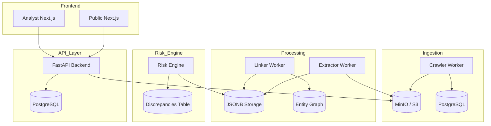

# Veritas Architecture

Veritas is an evidence-first procurement intelligence platform designed to bring transparency to Philippine government contracting.

## System Overview

The system follows a Phased Data Lifecycle: **Ingest → Extract → Risk Analysis → Audit → Public Disclosure**.

## Core Components

### 1. Backend (FastAPI)
- **Location:** `apps/api`
- **Responsibility:** Serves as the single source of truth for both Public and Analyst views.
- **Tech Stack:** Python 3.11+, SQLAlchemy (Async), Pydantic v2, Ruff.
- **Data Access:** Uses a typed query layer (`queries.py`) with Pydantic models for response validation.

### 2. Workers (Celery)
- **Crawler:** Periodic task to fetch data from government portals.
- **Extractor:** Uses OCR and LLMs to pull structured fields from raw documents.
- **Risk Engine:** Runs rule-based and statistical checks to fire discrepancies.

### 3. Frontend (Next.js)
- **Web Public:** Read-only view for citizens and NGOs. Focuses on search and case dossiers.
- **Web Analyst:** Write-capable console for verification, correction, and publication workflows.
- **Shared:** Logic and components are gradually being moved to `packages/`.

## Data Model Principles

1.  **Evidence-First:** Every claim must link to a `document_id` and include a `sha256_hash` for immutability.
2.  **Explainable Risk:** Discrepancies include `why_fired` metadata explaining the exact rule and threshold that triggered the flag.
3.  **Entity Resolution:** Suppliers are resolved to canonical identities to track performance across agencies.

## Quality Standards

- **Linting:** Python uses `ruff` (configured in `pyproject.toml`).
- **Types:** Frontend uses TypeScript with shared interfaces in `@veritas/types`.
- **Formatting:** Automated via `make format`.
